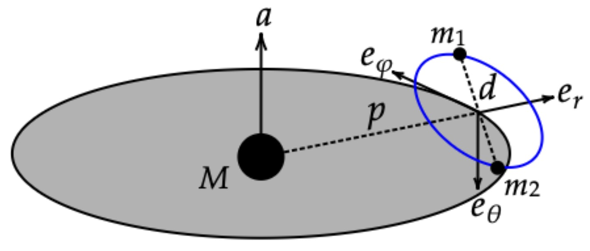
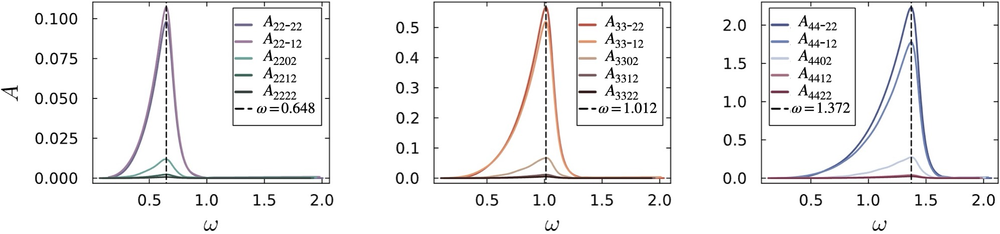

## Near-horizon perturbation of Kerr black holes

## High performance EMRI waveform generation based on Sasaki-Nakamura formalism

- Benefiting from the short-range nature of the Sasaki–Nakamura (SN) formalism, we can use it to compute gravitational-wave waveforms from point particles on both bound and unbound orbits.
- The difficulties in solving the inhomogeneous SN source term and evaluating the Green’s function integral can be avoided by applying the integration-by-parts (IBP) technique.
- See [$\texttt{GeneralizedSasakiNakamura.jl}$](https://github.com/ricokaloklo/GeneralizedSasakiNakamura.jl) for our code implementation.

See [arXiv:2511.08673](https://arxiv.org/abs/2511.08673) for details.

## Binary extreme-mass-ratio inspiral (b-EMRI) waveform modeling

- B-EMRIs are hierarchical triple systems consisting of a supermassive bleck hole (SMBH) and two staller mass black holes.

- We carried out a waveform model based on black hole perturbation theory and relativistic three-body dynamics.

- What's interesting is that the small binary could resonantly excite the quasi-normal modes of the SMBH, leading to some distinguishable features.

See [Phys. Rev. D 111. 103007](https://journals.aps.org/prd/abstract/10.1103/PhysRevD.111.103007) for details.

---
